# Чертежи деталей и модели

## Содержание

* [Коптер сборка](#коптер-сборка)
* [Верхняя дека](#верхняя-дека)
* [Комплект стенок](#комплект-стенок)
* [Корпус для 2х компасов V3](#корпус-для-2х-компасов_v3)
* [Корпус под шарик 20мм](#корпус-под-шарик-20мм-v12-2)
* [Крест](#крест)
* [Крышка для 2х компасов V3](#крышка-для-2х-компасов-v3)
* [Нижняя дека](#нижняя-дека)
* [Планшайба килсвитч](#планшайба-килсвитч)
* [Скоба крепления к раме](#скоба-крепления-к-раме)
* [Спуск2](#спуск2)
* [Стойка](#стойка)
* [Фланец Стойки](#фланец-стойки-22)

## Коптер сборка

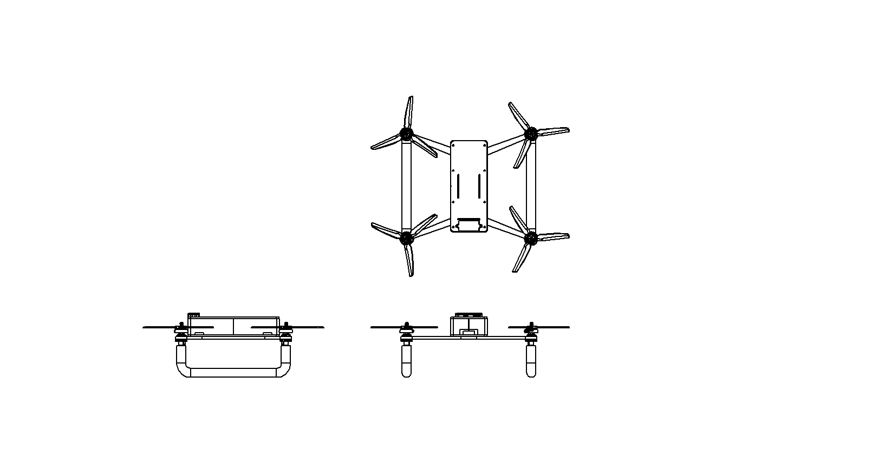
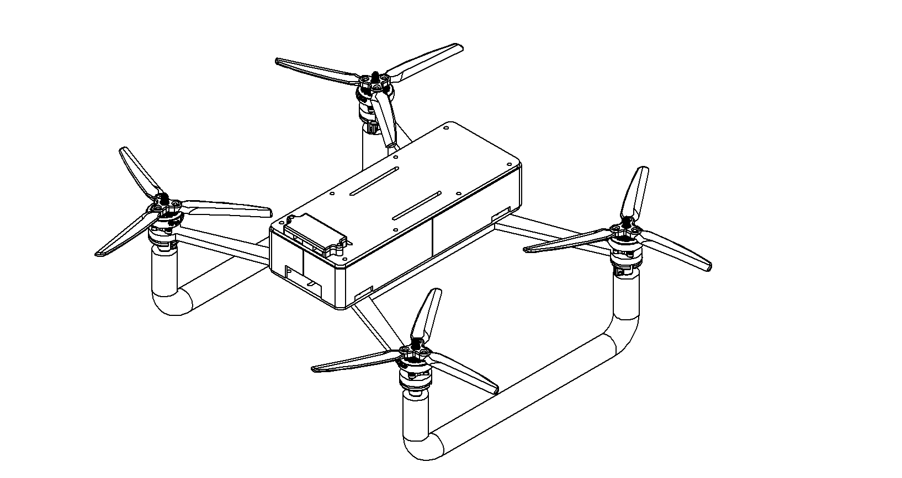

## Верхняя дека

* [Верхняя_дека.DWG](./Верхняя_дека.DWG)
* [Верхняя_дека.SLDPRT](./Верхняя_дека.SLDPRT)

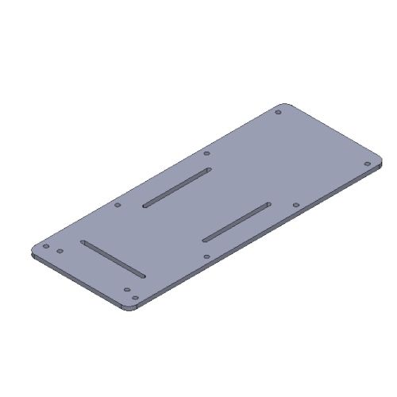
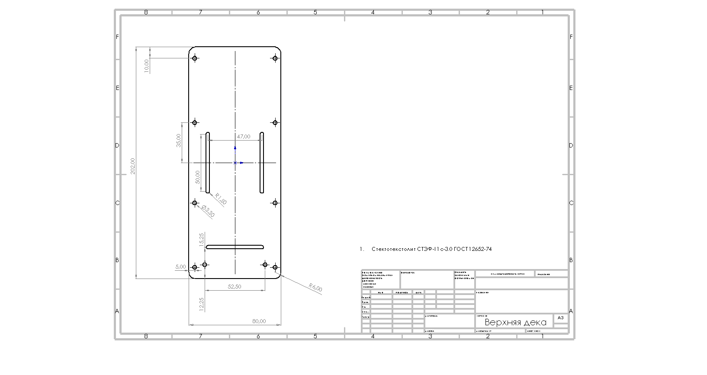

## Комплект стенок

* [Комплект_стенок.SLDPRT](./Комплект_стенок.SLDPRT)

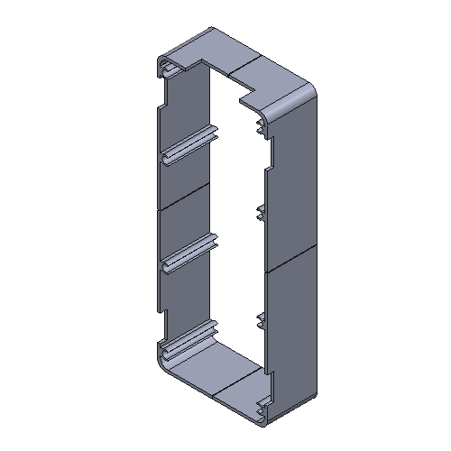
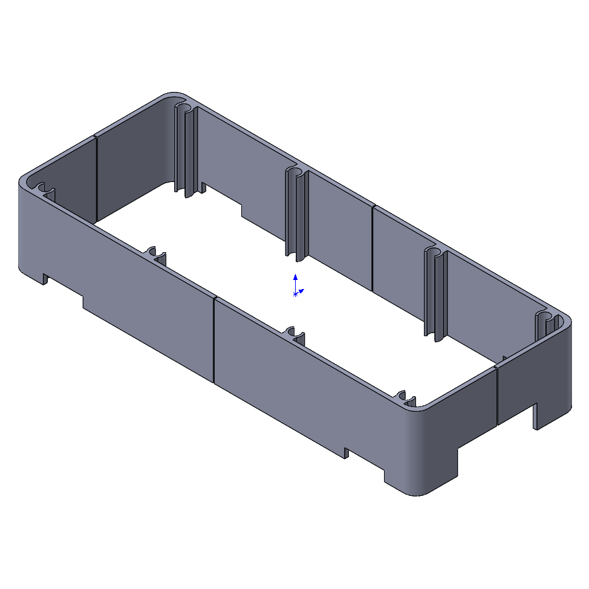

## Корпус для 2х компасов_V3

* [Корпус_для_2х_компасов_V3.SLDPRT](./Корпус_для_2х_компасов_V3.SLDPRT)

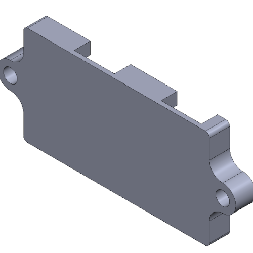

## Корпус под шарик 20мм v1.2-2

* [Корпус_под_шарик_20мм_v1.2.SLDPRT](./Корпус_под_шарик_20мм_v1.2.SLDPRT)
* [Корпус_под_шарик_20мм_v1.2.STL](./Корпус_под_шарик_20мм_v1.2.STL)

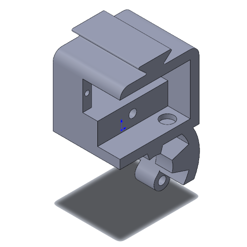
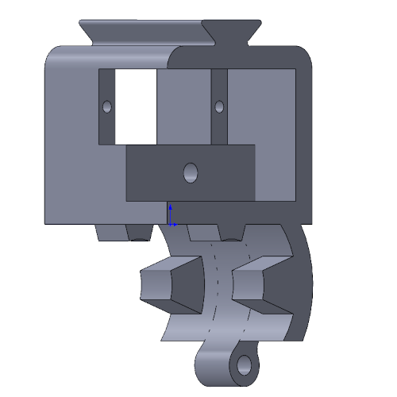

## Крест

* [Крест.DWG](./Крест.DWG)
* [Крест.SLDPRT](./Крест.SLDPRT)

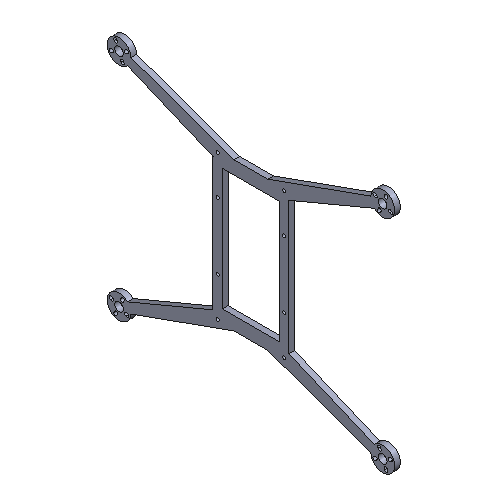
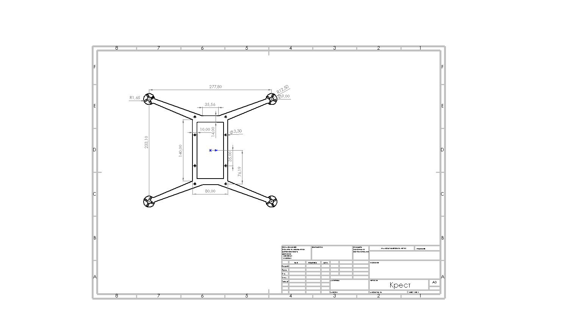

## Крышка для 2х компасов V3

* [Крышка_для_2х_компасов_V3.SLDPRT](./Крышка_для_2х_компасов_V3.SLDPRT)
* [Крышка_под_шарик_20мм_v1.2.SLDPRT](./Крышка_под_шарик_20мм_v1.2.SLDPRT)
* [Крышка_под_шарик_20мм_v1.2.STL](./Крышка_под_шарик_20мм_v1.2.STL)

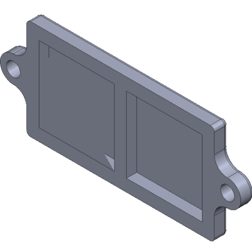
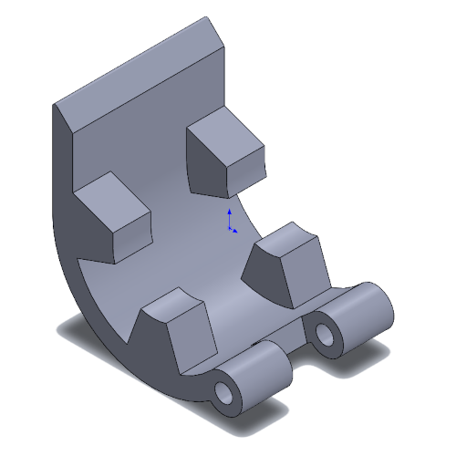
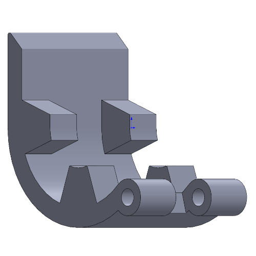

## Нижняя дека

* [Нижняя_дека.DWG](./Нижняя_дека.DWG)
* [Нижняя_дека.SLDPRT](./Нижняя_дека.SLDPRT)

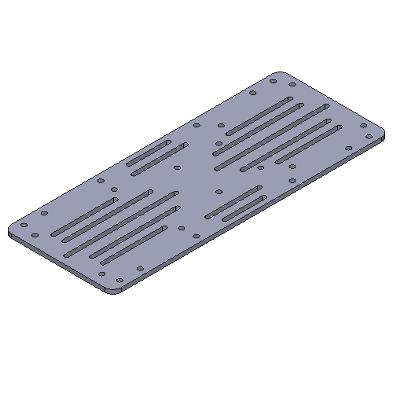
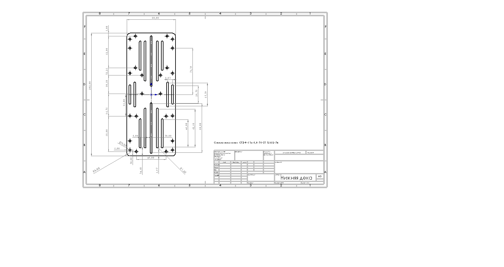

## Планшайба килсвитч

* [Планшайба_килсвитч.DWG](./Планшайба_килсвитч.DWG)
* [Планшайба_килсвитч.SLDPRT](./Планшайба_килсвитч.SLDPRT)

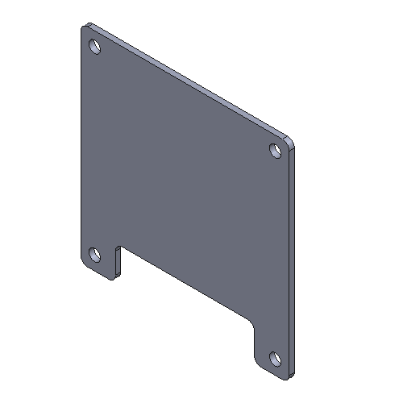
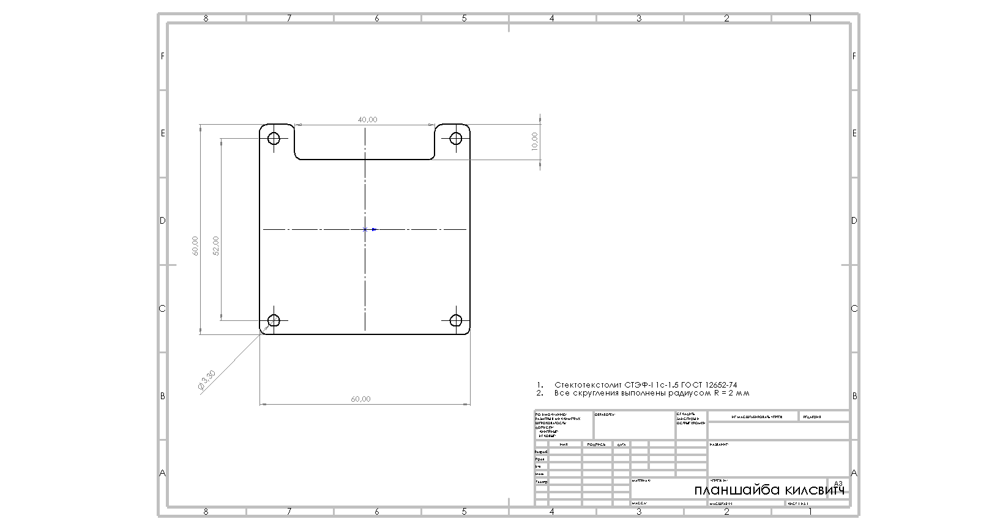

## Подвес

* [Подвес_ИТОГ.SLDASM](./Подвес_ИТОГ.SLDASM)

## Рама Сборка

* [Рама_Сборка.SLDASM](./Рама_Сборка.SLDASM)

## Скоба крепления к раме

* [Скоба_крепления_к_раме.SLDPRT](./Скоба_крепления_к_раме.SLDPRT)
* [Скоба_крепления_к_раме.STL](./Скоба_крепления_к_раме.STL)

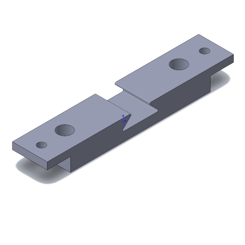

## Спуск2

* [Спуск2.SLDPRT](./Спуск2.SLDPRT)
* [Спуск2.STL](./Спуск2.STL)

## Стойка

* [Стойка.SLDPRT](./Стойка.SLDPRT)

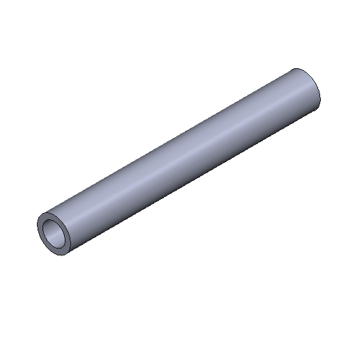

## Фланец Стойки 2.2

* [Фланец_Стойки_2.2.SLDPRT](./Фланец_Стойки_2.2.SLDPRT)
* [Фланец_Стойки_2.2.STL](./Фланец_Стойки_2.2.STL)

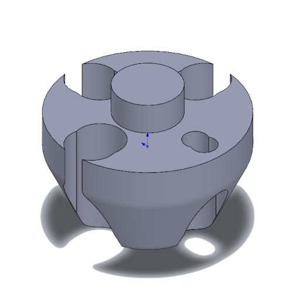